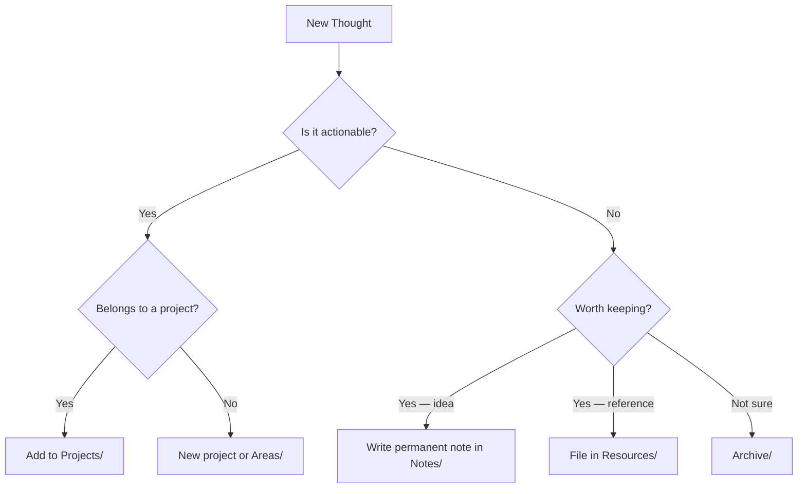
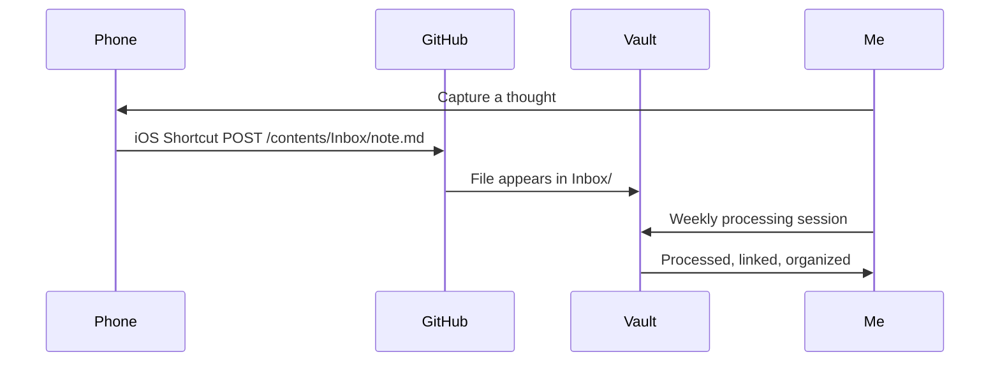
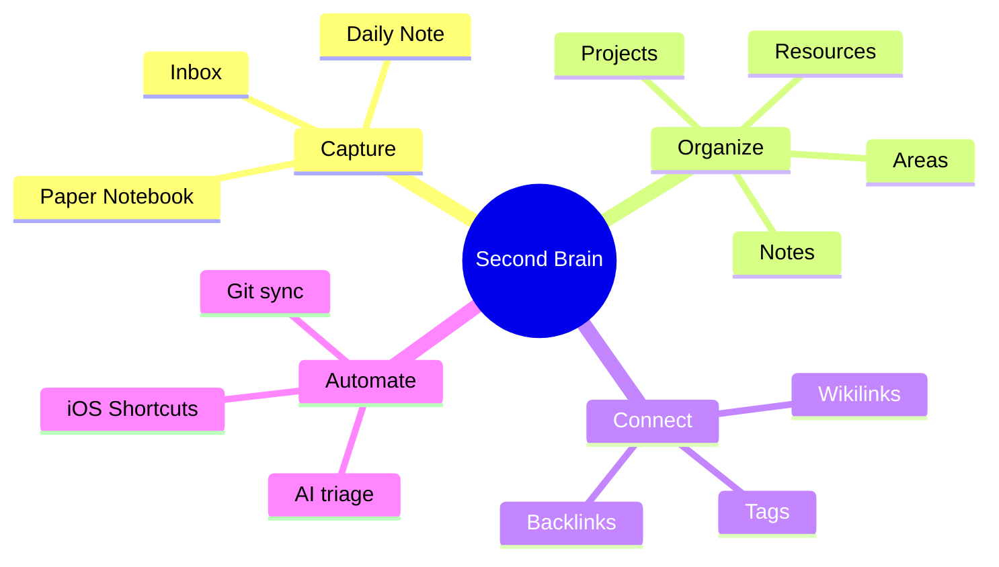
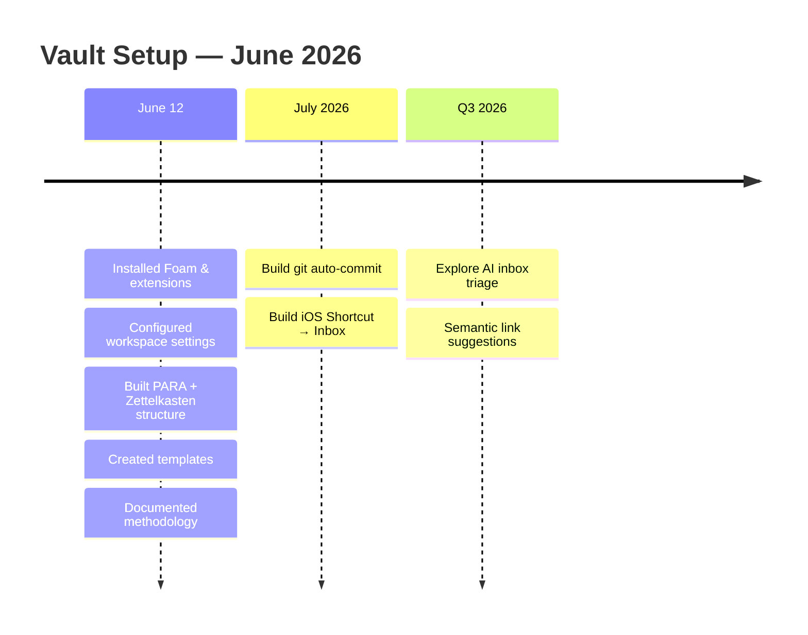
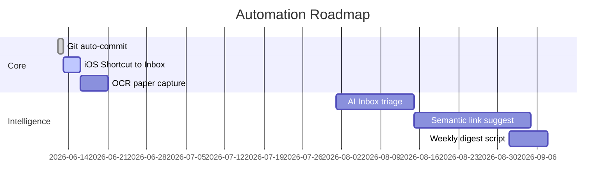
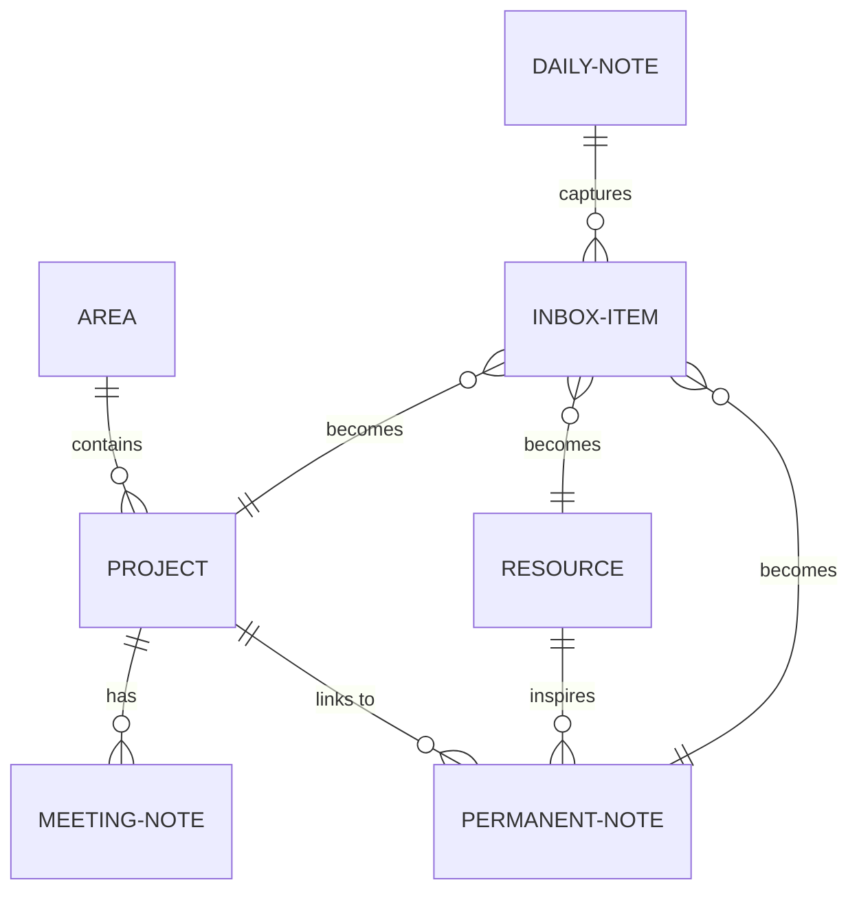
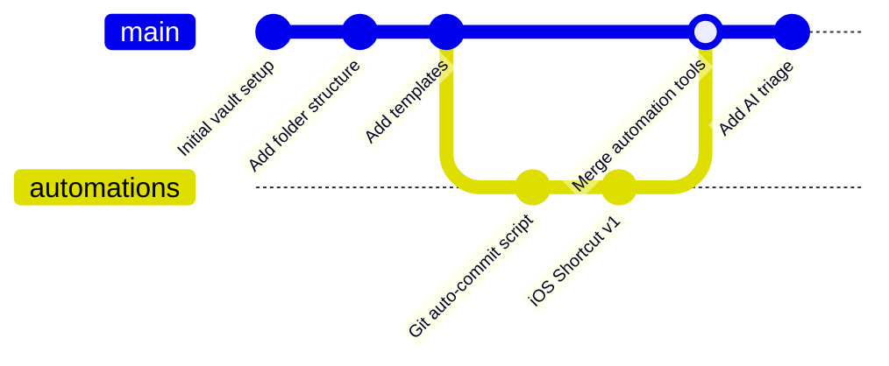

# Mermaid Diagrams — Demo & Reference

Open this file with **Markdown Preview Enhanced** (`Cmd+Shift+V`) to see all diagrams rendered.

---

## 1. Flowchart
The most common type. Great for decision trees, processes, and workflows.

---

## 2. Sequence Diagram
Shows interactions between people or systems over time. Great for documenting workflows or API flows.

---

## 3. Mind Map
Good for brainstorming and showing how topics branch out from a central idea.

---

## 4. Timeline
For project planning, historical notes, or any sequence of dated events.

---

## 5. Gantt Chart
Project planning with durations and dependencies.

---

## 6. Entity Relationship Diagram
Good for documenting data models or how concepts relate to each other.

---

## 7. Git Graph
Visualize a git branching history — handy for documenting dev workflows.

---

## Quick Reference

| Diagram Type | Best For |
|---|---|
| `flowchart` | Decision trees, processes, workflows |
| `sequenceDiagram` | Interactions between people/systems over time |
| `mindmap` | Brainstorming, topic exploration |
| `timeline` | Event history, project milestones |
| `gantt` | Project planning with dates and dependencies |
| `erDiagram` | Relationships between concepts or data models |
| `gitGraph` | Branching and merge history |

Full docs: [mermaid.js.org](https://mermaid.js.org/intro/)
